# LCD2USB

## Overview

LCD2USB is a open source/open hardware project. The goal of LCD2USB is to connect HD44780 based text LCD displays to various PCs via USB. LCD2USB was meant to be cheap and to be made of easily available parts. It is therefore based on the [Atmel AVR Mega8 CPU](http://www.atmel.com/dyn/products/product_card.asp?part_id=2004) and does not require any difficult to obtain parts like separate USB controllers and the like. The total cost (without display and pcb) are about 5 to 10 Euros. LCD2USB currently comes with a simple demo application that works under Linux, MacOS X and Windows.

LCD2USB is currently supported by [lcd4linux](http://ssl.bulix.org/projects/lcd4linux/) (LCD2USB support is built-in), [LCD Smartie](http://lcdsmartie.sourceforge.net/) (requires a [seperate driver](contrib/LCD2USB.dll)), and [LCDProc](http://lcdproc.org/) (LCD2USB support is built-in).

Every now and then i have spare PCBs available. Send me an email if you are interested.

LCD2USB makes use of several projects to achieve this goal. LCD2USB is based on:

*   [LCD4LINUX, a great framework to use small LCDs with linux](http://ssl.bulix.org/projects/lcd4linux/),
*   [AVR-USB, a pure software implementation of USB for the AVR plattform](http://www.obdev.at/products/avrusb/index.html),
*   [USBtiny, another software usb implementation for the AVR](http://www.xs4all.nl/~dicks/avr/usbtiny/), and
*   [Peter Fleurys LCD routines for the AVR](http://jump.to/fleury)

## Hardware

**The prototype board**

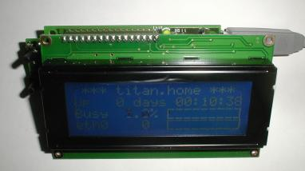 | 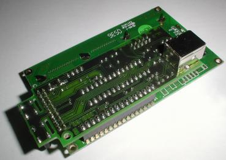
---- | ----
**The final pcb mounted on a 4x20 display** | **The USB connector is mounted on the rear PCB side**

The hardware of the LCD2USB interface consists of the [Atmel AVR Mega8 CPU](http://www.atmel.com/dyn/products/product_card.asp?part_id=2004), a cheap and easy to obtain microcontroller with 8 KBytes flash (of which ~3k are used in this application) and 2 KBytes RAM. The processor is surrounded by few parts, mainly connectors to interface to the PC and the LCD.

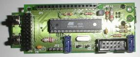

A power LED (LED1) indicates that the system is powered via USB. The system clock is derived from a 12Mhz crystal. This frequency is necessary due to the fact that the software USB implementation requires a precise timing with respect to the USB.

### The USB interface

The USB interface of the LCD2USB interface is based on a pure software implementation and uses three pins of the AVR (PC0, PC1 and PD2). This software implementation supports low speed USB only which is signalled to the PC by resistor R1\. The current version 1.1 of the LCD2USB operates the USB data lines at 3.6V which complies to the USB spec and increases compatibility over version 1.0.

The USB connection may be done via a USB B style connector. This is the square connector that is typically used for USB devices (unlike the flat A style connector used at USB hosts). The USB connector is to be **mounted at the solder side** (the rear side of the PCB without the white printing). Mounting it to the component side may damage the LCD2USB or even the PC when plugging it in. Alternally a cable may directly be attached to the component side of the board as depicted in the image below.

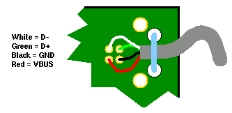 | 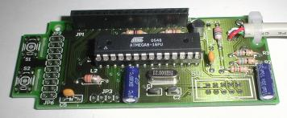
---- | ----
**Direct attachment of an USB cable** | **The minimum working setup for pre-flashed CPUs**

The whole device a so called bus powered device. This means that the complete device is powered directly from USB. Therefore the AVR and the LCD are powered from the USB VBUS signal. This signal can deliver max 500mA to a device. The power supply is filtered and buffered by C3 and C6.

### The LCD interface

The LCD2USB interface supports several different HD44780 based text displays. It supports single controller displays (tested with 16*2, 20*2 and 20*4) and dual controller displays (tested with 27*4 and 40*4). The LCD2USB interface uses the 4 bit interface provided by the HD44780.

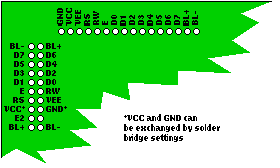

Two different connectors (JP1 and JP2) are present to interface to most common HD44780 displays. The extension connector JP6 expands JP2 for the dual controller display connectors as used on e.g. 40*4 displays. See figures for details. Since the power supply of the 40*4 connection varies from the 20*2 connector style, the solder bridges SJ2 and SJ3 allow to adjust the power supply polarity on JP2. The default setting is for the 20*2 style connection. The following image shows how to change the settings for a 4x40 display:

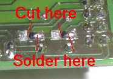

**Warning:** Using the wrong polarity will most likely destroy the LCD, the interface and may even damage the PCs USB port. Please make sure, that the connector of the display matches the signal layout on the LCD2USB board. You might want to use a USB hub between the LCD2USB and your PC during the first trials. This lowers the risk of damanging the PC if you didn't get the LCD power supply correctly. However, you may still damage the LCD2USB, the LCD and your hub.

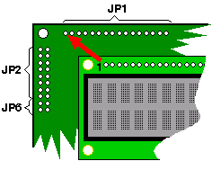 | 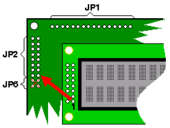 | 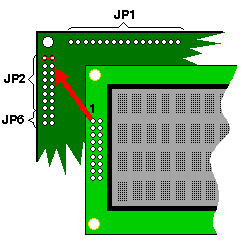
---- | ---- | ----
**Display: 2*16, 4*16, 4*20** | **Display: 2*20, 2*40** | **Display: 4*40 (adjust solder bridge!)**

#### Power supply considerations

Special care has to be taken with displays with backlighting. The LCD2USB has been designed to draw at most 75mA which is fine for typical LCDs with LED backlighting. This value is also reported to the host PC via the USB configuration. The LCD2USB interface hardware is able to supply up to 100mA via its software adjustable backlight control. This is a limitation of the transistor T1\. If the backlighting draws more than 100mA, transistor T1 has to be replaced (see the section "part list remarks" below for more details) and special care has to be taken not to overload the USB which can source at most 500mA in total to a bus powered device. An increased backlight current should be reflected in the USB configuration of the device by adjusting the value of <tt>USB_CFG_MAX_BUS_POWER</tt> in the file <tt>usbconfig.h</tt> of the firmware sourcecode. You'll then have to recompile the firmware to make it signal its increased power consumption via USB. These firmware changes may not be necessary with all PCs but some may even shut down the power supply for a device that actually draws more current than its USB descriptors indicate.

### Programming interface (ISP)

The firmware is uploaded using the standard 10 pin AVR ISP connector (SV1). A separate programming cable is required to load the firmware onto the LCD2USB. A [simple do-it-yourself cable](images/avrisp.gif) will be sufficient. A PC software like e.g. [Ponyprog](http://www.lancos.com/prog.html) or [UISP](http://savannah.nongnu.org/projects/uisp/) will then be used to upload the firware via this cable to the AVR on the LCD2USB device. The programming cable is only required once, since the firmware is permanently stored in the AVRs internal flash memory.

### The serial interface

Connector JP3 provides the serial interface of the AVR. This connector is meant for debugging purposes only and must not be directly connected to a PCs RS232 interface. Instead a level shifter (e.g. MAX232) must be inserted.

### Schematics and pcb layout

[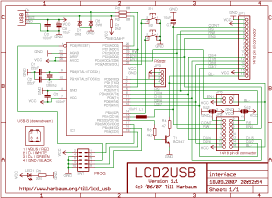](circuit/schematic.pdf) [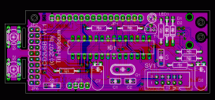](circuit/pcb.pdf) 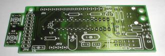

#### NEW: PCB version 1.1

The latest PCB version includes the two zener diodes to increase USB compatibility. Furthermore the power supply inductor has turned out not to be neccessary and has thus been removed to make space for the new zener diodes.

I sometimes have spare PCBs. Send me an email if you want to buy one of them.

### Part list

You can get all parts directly via the [lcd2usb part list at Reichelt](http://www.reichelt.de/?ACTION=20;AWKID=50388;PROVID=2084). This list is for the V1.1 pcb and includes the following parts:

Part | Qty | Name | [Reichelt Part No.](http://www.reichelt.de) | [Conrad Part No.](http://www.conrad.de)
---- | ---- | ---- | ---- | ----
Q1 | 1 | 12Mhz crystal, HC49U package | 12,0000-HC49U-S | 445167
R1 | 1 | 2.2k ohm resistor | 1/4W 2,2k | 403296
R2, R3 | 2 | 68 ohm resistor | 1/4W 68 | 403113
R4 | 1 | 47 ohm resistor | 1/4W 47 | 403091
R5 | 1 | 220 ohm resistor | 1/4W 220 | 403172
R6 | 1 | 4.7k ohm resistor | 1/4W 4,7k | 403334
C1, C2 | 2 | 22pF ceramic capacitor, 2.54mm | KERKO 22P | 457167
C3, C5 | 2 | 100nF capacitor, 5.08mm | X7R-5 100N | 453358
C6, C7 | 2 | 10μF electrolytic capacitor | RAD 10/35 | 472484
T1 | 1 | BC547C transistor | BC 547C | 154989
L1 | 1 | 10μH inductor | SMCC 10μ | 535729
S1, S2 | 2 | push button | TASTER 9305 | 700460
SV1 | 1 | 10 pin ISP connector | WSL 10G | 744026
JP1 | 1 | display connector | BL 1X20G 2,54 | 734993
JP2, JP6 | 1 | display connector | BL 2X10G 2,54 | 741159
-- | 1 | display side connector for JP2/JP6 | SL 2X10G 2,54 | 744026
JP3 | 1 | 4 pin debug connector, display side connector for JP1 | SL 1X36G 2,54 | 744018
LED1 | 1 | LED 3mm green | LED 3MM GN | 184713
-- | 1 | USB-B print connector | USB BW | 743950
IC1 | 1 | Atmega8-16 DIP | ATMEGA 8-16 DIP | 154054
-- | 1 | socket for IC1 | GS 28P-S | 189515
D1, D2 | 2 | 3.6V zener diode | ZF 3,6 | 180050

Additionally required: Display, USB cable

#### Part list remarks

The crystal should be in the small HC49U package. You can use a crystal in HC18 package, but you'd then have to mount it from the rear pcb side.

C1 and C2 should have their pins 2.54mm (1/10 inch) apart, C3 and C5 have their pins 5.08mm (2/10 inch) apart.

Although T1 is labeled BC547C, a BC547A or BC547B will be fine as well.

The cathode of LED1 faces the R5 label. The long leg of the LED is thus close to JP1.

Resistor R4 is the current limiting resistor for backlighting. The 47 ohm in the part list is a useful and secure value for some LCDs with low power LED backlighting. Some displays already include the current limiting resistor and/or require a higher current. The symptom usually is a very dark or even barely visible backlighting with R4 at 47 ohms. You can lower the value of R4 in order to increase the backlight current and thus the brightness. Please consult the datasheet of your display for its backlight power requirements and in order to select the correct current limiting resistors. The BC547 transistor T1 may not be sufficient for displays requiring backlight currents > 100mA. A user has reported success by replacing T1 with a BS170 MOSFET and driving the backlight with 240mA.

## Uploading the firmware

If you are familiar with Atmel programming you probably know what you are doing. The Makefile in lcd2usb/firmware/Makefile assumes, that you are using a [simple stk200 compatible printer port adapter](images/avrisp.gif). This is e.g. the same one as sold by [emedia](http://www.emedia.de) for the BlueMP3 device.

Connect the assembled device (no display required yet) via USB to the PC. It will not be detected yet, since it doesn't contain the firmware. Connect it via the download cable and the programming adapter to the linux pc with installed [uisp tool](http://savannah.nongnu.org/projects/uisp/) and type "make fuse; make flash-nodep" to upload the firmware.

If the Makefile doesn't work for you you can also flash the device manually using [avrdude](http://www.nongnu.org/avrdude/) and the aforementioned stk200 compatible printer port adapter with the following parameters:

<pre>avrdude -c stk200 -p atmega8 -U lfuse:w:0x9f:m -U hfuse:w:0xc9:m -U flash:w:firmware-avrusb.hex
</pre>

As of LCD2USB version 1.4, download via usb with the [USBasp tool](http://www.fischl.de/usbasp/) using [avrdude](http://www.nongnu.org/avrdude/) is supported as well. Type "make avrdude-nodep" to upload the firmware this way.

To manually upload the firmware using the [usbasp](http://www.fischl.de/usbasp/) just use the follwing command:

<pre>avrdude -c usbasp -p atmega8 -U lfuse:w:0x9f:m -U hfuse:w:0xc9:m -U flash:w:firmware-avrusb.hex
</pre>

If your are familiar with a different AVR programming system you can of course use that one as well. But you'll probably have to do some minor adjustments in the Makefile.

## Protocol description

For simplicity reasons, the LCD2USB interface only uses USB control messages. More efficient and faster bulk transfers are only available to high speed devices. A USB control message for a low speed device consists of exactly 8 Bytes. The first byte indicates the control type and has to be set to a fixed value for vendor specific commands like the LCD2USB is using for its own purposes (non vendor specific commands are e.g. used to request the device name and id etc). The remaining seven bytes are the request type (1 byte), a value (2 bytes), an index (2 bytes) and a length field (2 bytes) for data being transmitted with the control transfer. The LCD2USB protocol does not send extra data, thus the last two bytes should be 0 for compatibility reasons. The remaining four bytes (two bytes value and two bytes index) are left for the data transfer. These are used to transmit up to four data bytes per transfer. Four HD44780 command bytes or four HD44780 data bytes can thus be transferred during one USB transaction.

### Details for the request byte

<pre>Bit   7 6 5 4 3 2 1 0
Name  C C C T T R L L
</pre>

<pre>CCC = command type
  0 (000) = echo
  1 (001) = command
  2 (010) = data
  3 (011) = set
  4 (100) = get
  5 (101) = reserved for future use
  6 (110) = reserved for future use
  7 (111) = reserved for future use
</pre>

<pre>TT = target id
R = reserved for future use, set to 0
LL = number of bytes in transfer - 1
</pre>

The target id has different meaning for the different requests. For command and data transfers it is a two bit bitmap indicating which of the two possible controllers supported by the LCD2USB interface is addressed. Both controllers may be addressed at the same time (e.g. to setup user defined characters).

For set and get operations the target id specifies the value to set or get. Currently supported values are:

<pre>set 0 - set brightness
set 1 - set contrast
get 0 - get firmware version (msb = major version, lsb = minor version)
get 1 - get button bitmap
get 2 - get detected controllers
</pre>

See the testapp source code delivered with the LCD2USB firmware archive for further details.

## Software

The LCD2USB interface was originally developed for use with [lcd4linux](http://ssl.bulix.org/projects/lcd4linux/). In the meantime [LCD Smartie](http://lcdsmartie.sourceforge.net/) and [LCDProc](http://lcdproc.org/) have been extended to support the LCD2USB as well. The LCD2USB software archives contain a little demo application that can be used as a basis for further LCD2USB ports. Currently Linux, MacOS X and Windows are supported by this application.

### Using LCD2USB under Windows

Harald Körfgen wrote a LCD Smartie plugin for LCD2USB finally allowing the LCD2USB to be used under Windows as well. Here's what he writes about his plugin:

[LCD2USB-smartie.zip](contrib/LCD2USB-smartie.zip) contains all the necessary source files requried to compile the driver with Microsoft ® Windows Server® 2003 R2 Platform SDK, Microsoft Visual C++ 2005 Express Edition and LibUsb-Win32\. [LCD2USB.dll](contrib/LCD2USB.dll) is the resulting file.

In order to use the driver libusb-win32 has also to be installed and the [LCD2USB.dll](contrib/LCD2USB.dll) has to be placed in the "displays" directory of LCD Smartie and it will be auto-detected and automatically be used. He has only tested his driver with a 20x4 display yet, so feedback is welcome.

## Troubleshooting

Problem: The device seems to work fine, it is detected correctly by Linux, but i get various error messages when accessing it from the test application.

Solution: Make sure that you run the test application as the root user since the standard user may lack the rights to access all aspects of the lcd2usb hardware.

Problem: The device is not properly detected. Linux reports an error like "device not accepting address" in the system log but the LCD displays the init message (LCD2USB VXX.XX).

Solution: The USB interface is not working at all. Your AVR is very likely running at the wrong speed. Please make sure that the fuses are set correctly. If this doesn't help, the zener diodes may be too slow (see next problem).

Problem: The device is not properly detected. Linux reports an an error like "device descriptor read/all, error -71" in the system log.

Solution: The device is working partly and the USB transfers are unreliable. This was often caused by "slow" high current zener diodes which i had on the Reichelt part list some time ago. These slow diodes are easily recognized as they have thicker wires than the other parts. You can just try to remove the zener diodes and the device will work if your host PC copes with 5V on the USB data lines (most PCs do, especially older ones). Also using a USB hub between a device without zener diodes and the PC may lead to a working setup even if the PC does not accept 5V on the USB data lines. Otherwise you need faster diodes as a replacement like the one available from reichelt under part no "ZF 3,6". These are also part of the current part list and are known to work.

## Links

*   [LCD4LINUX, lcd interfacing for linux](http://ssl.bulix.org/projects/lcd4linux/)
*   [AVR-USB, software USB for the AVR plattform](http://www.obdev.at/products/avrusb/index.html)
*   [USBtiny, another software usb implementation for the AVR](http://www.xs4all.nl/~dicks/avr/usbtiny/)
*   [LCD routines for the AVR plattform](http://jump.to/fleury)
*   [USB user space library libusb](http://libusb.sourceforge.net/)
*   [Win32 port of libusb](http://libusb-win32.sourceforge.net/)
*   [LCD Smartie, the Windows pendant of lcd4linux](http://lcdsmartie.sourceforge.net/)
*   [Later version of LCDproc include LCD2USB support](http://lcdproc.org/)

## User contributions

*   [Gallery of LCD2USB assembly](http://gallery.port23.de/v/bastard/wrap/lcd/?g2_page=4&g2_navId=x4b94fc39)
*   [Support for 12 button matrix keyboard on lcd2usb](http://lists.omnipotent.net/pipermail/lcdproc/2010-February/013267.html)
